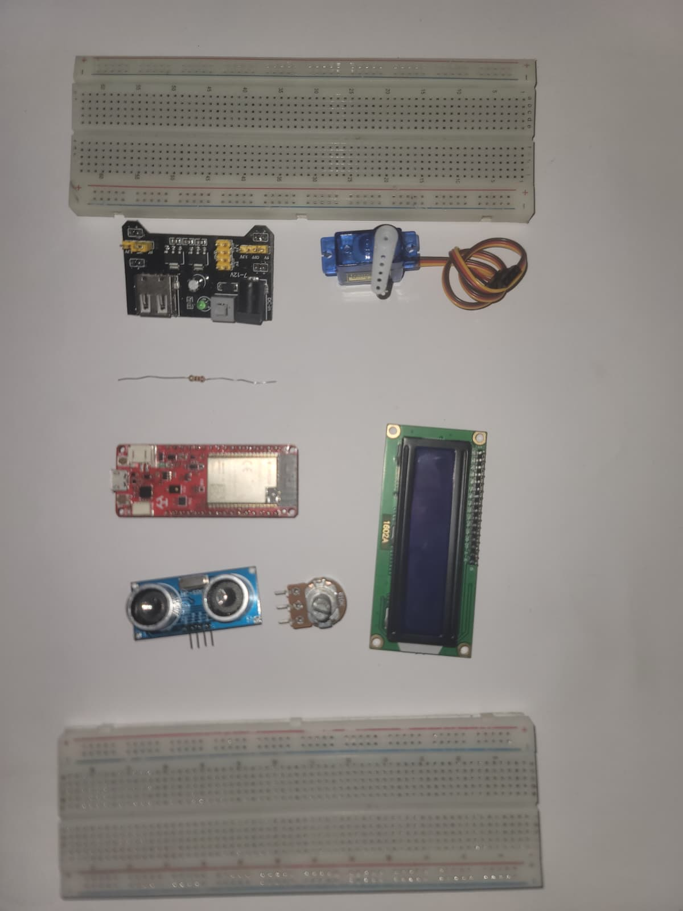

# AEGIS — Networked Rotating Ultrasonic Radar System


A real-time radar system built on the **Deneyap Kart 1A (ESP32-S3)**. AEGIS sweeps a servo-mounted HC-SR04 ultrasonic sensor across a 180° arc, streams live telemetry over WebSocket, and serves a full mission-control dashboard from the board itself — no external server, no app install, just a browser.

---

## Features

**Hardware**

- Continuous 0–180° servo sweep with configurable range, speed, and step size
- HC-SR04 ultrasonic ranging up to 300 cm
- 1602A LCD displaying live angle, distance, and detection state — flicker-free, no `clear()` in loop
- Graceful offline fallback: if Wi-Fi is unavailable the radar loop continues and the LCD remains live

**Web Dashboard** (served directly from the board at `http://<device-ip>`)

- Live radar scope with phosphor trail, sweep beam, and range rings
- Adjustable detection threshold ring rendered on-canvas
- **Manual Steer Mode** — click or drag on the radar canvas to aim the servo directly
- **Threat Perimeter** — draw a custom polygon on the radar; detections inside trigger a breach alarm
- Waterfall history strip showing distance over time
- Signal waveform panel with motion intensity meter
- Alert log with INNER / OUTER zone classification and unread badge counter
- **Audio Engine** — sonar ping tones scaled by target distance (Web Audio API)
- Animated globe widget with rotating world map and position marker
- System telemetry panel: CPU %, memory %, uptime, ESP32 chip temp
- Auto-reconnecting WebSocket — survives page reload and short network drops

**Firmware Controls** (all runtime-adjustable from the dashboard, no reflash needed)

| Command          | Effect                                |
| ---------------- | ------------------------------------- |
| `SET_SWEEP_MIN`  | Left boundary of sweep arc (0–180°)   |
| `SET_SWEEP_MAX`  | Right boundary of sweep arc (0–180°)  |
| `SET_STEP_DEG`   | Angular resolution per step (1–10°)   |
| `SET_STEP_DELAY` | Milliseconds between steps (5–200 ms) |
| `SET_THRESHOLD`  | Detection distance in cm (1–300 cm)   |
| `MANUAL_STEER`   | Point servo to a specific angle       |
| `AUTO_RESUME`    | Return to automatic sweep             |

▶ [Full demo on YouTube](https://youtu.be/lgbAfCLylXU)

---

## Hardware Requirements

| Component                      | Quantity | Notes                                                    |
| ------------------------------ | -------- | -------------------------------------------------------- |
| Deneyap Kart 1A                | 1        | ESP32-S3 based; other ESP32 boards require pin remapping |
| HC-SR04 Ultrasonic Sensor      | 1        | 5 V supply required                                      |
| SG90 Servo Motor               | 1        | 5 V supply required; never power from board 3.3 V        |
| 1602A LCD (HD44780-compatible) | 1        | 16-pin, 4-bit parallel mode                              |
| MB102 Breadboard Power Module  | 1        | Supplies 5 V to servo, sensor, and LCD                   |
| 9 V DC wall adapter            | 1        | Centre-positive, ≥ 1 A; **do not use a 9 V PP3 battery** |
| 10 kΩ potentiometer            | 1        | LCD contrast adjustment                                  |
| 220 Ω resistor                 | 1        | LCD backlight current limiting                           |

---

## Wiring

Full pin-level connection map is in **[WIRING.md](WIRING.md)**.

Quick summary:

| Deneyap Pin | Connected to                             |
| ----------- | ---------------------------------------- |
| D0          | SG90 PWM signal                          |
| D1          | HC-SR04 TRIG                             |
| D11         | HC-SR04 ECHO                             |
| D4          | LCD Enable                               |
| D5–D7       | LCD D4–D6                                |
| D10         | LCD RS                                   |
| D12         | LCD D7                                   |
| GND         | MB102 GND rail (mandatory common ground) |

> **Critical:** The MB102 GND rail **must** be wired to the Deneyap Kart GND pin. Without a shared ground reference all signal levels are undefined.

---



## Software Setup

### 1. Prerequisites

- [Arduino IDE 2.x](https://www.arduino.cc/en/software) (or Arduino CLI)
- Deneyap Kart board package installed in Arduino IDE
  - Add this URL under _File → Preferences → Additional boards manager URLs_:
    ```
    https://raw.githubusercontent.com/deneyapkart/deneyapkart-arduino-core/master/package_deneyapkart_index.json
    ```
  - Then install **Deneyap Kart** via _Tools → Board → Boards Manager_

### 2. Install Required Libraries

Open _Tools → Manage Libraries_ and install:

| Library     | Author           |
| ----------- | ---------------- |
| WebSockets  | Markus Sattler   |
| ESP32Servo  | Kevin Harrington |
| ArduinoJson | Benoit Blanchon  |

`LiquidCrystal` and `WiFi` are bundled with the Deneyap / ESP32 board package and require no separate install.

### 3. Configure Wi-Fi Credentials

Copy the example secrets file and fill in your network details:

```bash
cp firmware/aegis-deneyap/secrets.h.example firmware/aegis-deneyap/secrets.h
```

Edit `secrets.h`:

```cpp
#define WIFI_SSID     "your_network_name"
#define WIFI_PASSWORD "your_password"
```

> **`secrets.h` is listed in `.gitignore` and will never be committed.**

### 4. Flash the Board

1. Open `firmware/aegis-deneyap/aegis-deneyap.ino` in Arduino IDE
2. Select _Tools → Board → Deneyap Kart 1A_
3. Select the correct COM port under _Tools → Port_
4. Click **Upload**

On first boot the LCD will display `AEGIS v1.0` then `Connecting WiFi`. Once connected, the LCD shows the board's IP address for ~3 seconds before the radar loop begins.

### 5. Open the Dashboard

On any device connected to the same Wi-Fi network, open a browser and navigate to:

```
http://<ip shown on lcd or in serial monitor 115200>
```

The dashboard loads instantly — it is served directly from the board's flash memory. No internet connection is required after the fonts load on first visit (or if you remove the Google Fonts import from `dashboard.h` for fully offline use).

---

## Project Structure

```
aegis-embedded-system/
├── assets/                   # Images and media
├── firmware/
│   └── aegis-deneyap/
│       ├── aegis-deneyap.ino # Main firmware — radar loop, Wi-Fi, WebSocket server
│       ├── dashboard.h       # Self-contained HTML/CSS/JS dashboard, stored in ESP32 flash
│       ├── secrets.h         # Wi-Fi credentials — NOT committed (see .gitignore)
│       └── secrets.h.example # Template — copy this to secrets.h
├── hardware/
│   ├── aegis.kicad_sch       # KiCad schematic
│   ├── aegis.kicad_pcb       # KiCad PCB layout
│   ├── aegis.kicad_pro       # KiCad project file
│   └── HC-SR04/              # HC-SR04 sensor symbol/footprint reference
├── .gitignore
├── README.md
└── WIRING.md                 # Full pin-level wiring reference
```

---

## How It Works

AEGIS runs a **non-blocking sweep loop** — there is no `delay()` in the main loop. Each tick is gated by a millisecond timer, which keeps the WebSocket and HTTP stacks responsive between steps.

**Data flow:**

```
[Servo position] → [HC-SR04 pulse] → [distance measurement]
       ↓                                        ↓
  [LCD update]                     [WebSocket broadcast]
                                            ↓
                                   [Browser radar canvas]
```

**Inbound commands** from the browser arrive as JSON over WebSocket port 81 and are applied immediately to the live sweep parameters — no reflash, no restart.

**Offline mode:** if Wi-Fi association fails after 30 attempts (~12 seconds), AEGIS displays `OFFLINE MODE` on the LCD and continues the radar loop locally. The dashboard is unavailable in this state but all hardware functions normally.

---

## WebSocket Protocol

The board broadcasts one frame per sweep step on **port 81**.

**Outbound (board → browser):**

```json
{ "a": 90, "d": 34.2, "det": true }
```

- `a` — current servo angle (0–180°)
- `d` — measured distance in cm, or `-1` if out of range
- `det` — `true` if distance is within the detection threshold

**Inbound (browser → board):** see the [Firmware Controls](#firmware-controls) table above.

---

## License

MIT License — see [LICENSE](LICENSE) for full terms.
base) PS C:\Users\Yousef\Desktop\aegis-embedded-system> git add .
warning: in the working copy of 'firmware/aegis-deneyap/secrets.h', LF will be replaced by CRLF the next time Git touches it
warning: adding embedded git repository: hardware/.history
hint: You've added another git repository inside your current repository.
hint: Clones of the outer repository will not contain the contents of
hint: the embedded repository and will not know how to obtain it.
hint: If you meant to add a submodule, use:
hint:
hint: git submodule add <url> hardware/.history
hint:
hint: If you added this path by mistake, you can remove it from the
hint: index with:
hint:
hint: git rm --cached hardware/.history
hint:
hint: See "git help submodule" for more information.
hint: Disable this message with "git config set advice.addEmbeddedRepo false"
(base) PS C:\Users\Yousef\Desktop\aegis-embedded-system>

---

## Acknowledgements

- [WebSockets library](https://github.com/Links2004/arduinoWebSockets) — Markus Sattler
- [ESP32Servo](https://github.com/madhephaestus/ESP32Servo) — Kevin Harrington
- [ArduinoJson](https://arduinojson.org) — Benoit Blanchon
- Deneyap Kart hardware and board support — [Deneyap](https://deneyapkart.org)
- [HC-SR04 KiCad Model](https://www.snapeda.com/parts/HC-SR04/SparkFun/view-part/) — SparkFun
